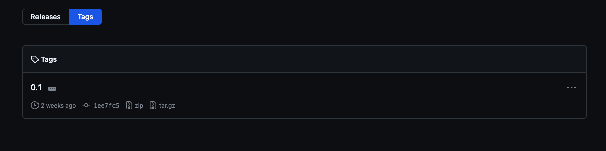

# log_central

Module created to take the information of the integrations and send to our central database.

Use env variables of the connection to local and remote database.

# HOW TO INSTALL

check the last release, and copy link to zip file


image.png


Then install directly from github

```cmd
pip install https://github.com/onebeatBrazil/log_central/archive/refs/tags/0.1.zip
```


# hOW TO USE
```python

from log_central.info_to_central import client_to_central

try:
    client_to_central(client, ENGINE_ONEBEAT, ENGINE_CENTRAL, CURRENT_DATE)
except Exception as eGet: print(client,': Error in getClientInfoFromCentralDB: ',eGet)

